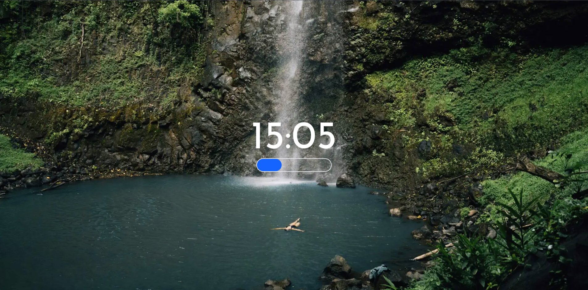
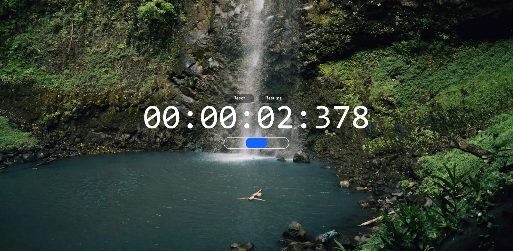

# Flowcus - a simplified clock for your long focus session
> This project is under development.

## Getting started

```bash
# Install dependencies
yarn

# Run development server
yarn dev

# Run production server
yarn build
yarn start
```

## Screenshots


